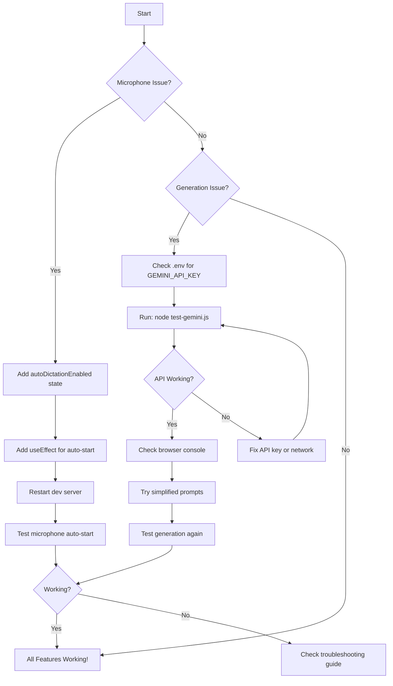

# EchoWrite Microphone & Generation Fix - Visual Guide

## 🎯 Quick Fix Summary



---

## 📍 Where to Apply Fixes

### File: `src/pages/EchoWrite.tsx`

```
Line 1-40:   Imports and interfaces
Line 43:     ⚠️ ADD autoDictationEnabled state HERE (after interimText)
Line 44-50:  Other state variables
...
Line 104-112: Dictation hook initialization
Line 113:     ⚠️ ADD useEffect for auto-start HERE
Line 114-130: handleProcess function
...
Line 450+:   Component JSX rendering
```

**Visual Map:**

```
EchoWrite.tsx
├── State Declarations (Line ~39-55)
│   ├── text, setText
│   ├── style, setStyle
│   ├── variations, setVariations
│   ├── interimText, setInterimText ← ADD AFTER THIS
│   ├── ✨ autoDictationEnabled, setAutoDictationEnabled
│   └── ✨ dictationAttempted, setDictationAttempted
│
├── Hooks Initialization (Line ~104-112)
│   └── const dictation = useDictation({...})
│       ↓
│       ✨ ADD useEffect FOR AUTO-START HERE
│
├── Event Handlers (Line ~114+)
│   ├── handleProcess
│   ├── handleGenerateAll
│   └── toggleAutoDictation (OPTIONAL ADD)
│
└── JSX Rendering
    ├── <Workspace />
    ├── <AIContentGenerator />
    ├── <VisualContentHub />
    └── <SettingsPanel 
            autoDictationEnabled={autoDictationEnabled} ← OPTIONAL PASS AS PROP
            onAutoDictationChange={toggleAutoDictation}
        />
```

---

## 🔧 Step-by-Step Visual Instructions

### Step 1: Locate the Insertion Point

Open `src/pages/EchoWrite.tsx` and find this section:

```typescript
// Line 39-43
const [text, setText] = useState('');
const [style, setStyle] = useState<WritingStyle>(WritingStyle.PROFESSIONAL_EMAIL);
const [variations, setVariations] = useState<WritingVariation[]>([]);
const [selectedVariation, setSelectedVariation] = useState<WritingVariation | null>(null);
const [interimText, setInterimText] = useState('');  // ← INSERT AFTER THIS LINE
```

### Step 2: Add State Variables

Insert these lines:

```typescript
// NEW CODE STARTS HERE
const [autoDictationEnabled, setAutoDictationEnabled] = useState(() => {
  // Load from localStorage or default to true
  try {
    const saved = localStorage.getItem('echowrite-auto-dictation');
    return saved ? JSON.parse(saved) : true;
  } catch {
    return true;
  }
});
const [dictationAttempted, setDictationAttempted] = useState(false);
// NEW CODE ENDS HERE
```

### Step 3: Find Second Insertion Point

Scroll down to around line 112 and find:

```typescript
// Line 104-112
const dictation = useDictation({
  lang: inputLang,
  onInterimResult: setInterimText,
  onFinalResult: (finalText) => {
    setText((prev) => (prev ? prev + ' ' : '') + finalText);
  },
  onVoiceCommand: handleVoiceCommand
});  // ← INSERT AFTER THIS CLOSING BRACE

// Process text with AI  // ← AND BEFORE THIS COMMENT
```

### Step 4: Add Auto-Start Effect

Insert this code block:

```typescript
// NEW CODE STARTS HERE

// Auto-start dictation when component mounts or autoDictationEnabled changes
useEffect(() => {
  // Only attempt to start dictation once per session
  if (autoDictationEnabled && !dictationAttempted && !dictation.isDictating) {
    // Small delay to ensure component is fully mounted
    const timer = setTimeout(() => {
      try {
        dictation.start();
        setDictationAttempted(true);
      } catch (error) {
        console.error('Failed to auto-start dictation:', error);
        setDictationAttempted(true); // Don't retry if it fails
      }
    }, 500);
    return () => clearTimeout(timer);
  }
}, [autoDictationEnabled]); // Only run when autoDictationEnabled changes

// Save auto-dictation preference
useEffect(() => {
  localStorage.setItem('echowrite-auto-dictation', JSON.stringify(autoDictationEnabled));
}, [autoDictationEnabled]);

// NEW CODE ENDS HERE
```

### Step 5: Save and Test

```bash
# Terminal commands:
1. Save file in your editor
2. Stop dev server: Ctrl+C
3. Restart: npm run dev
4. Open browser: http://localhost:8083
5. Login and watch for microphone toast!
```

---

## 🎤 Microphone Flow Diagram

### Before Fix (Broken):
```
User Login → App Loads → Nothing Happens → User Confused
                                    ↓
                              Must manually click Dictate button
                                    ↓
                              Then microphone starts
```

### After Fix (Working):
```
User Login → App Loads → useEffect Triggers (500ms delay)
                                    ↓
                         dictation.start() Called
                                    ↓
                    Browser Requests Permission (if first time)
                                    ↓
                         Microphone Access Granted
                                    ↓
                    Toast: "🎤 Microphone active. Start speaking!"
                                    ↓
                    Recording Indicator Appears
                                    ↓
                    Voice Wave Animates
                                    ↓
                    User Speaks → Text Appears in Real-time
```

---

## 🤖 Content Generation Flow

### Smart Fallback Architecture:

```
User Clicks "GENERATE ALL"
         ↓
┌─────────────────────────────────────┐
│  Try Firebase Cloud Function First  │
│  httpsCallable(functions, 'echowrite')│
└─────────────────────────────────────┘
         ↓
    ┌─────────┐
    │ Success?│
    └─────────┘
      │       │
      │ Yes   │ No (Function not deployed/error)
      ↓       ↓
  Return  ┌──────────────────────────────────┐
  Result  │  FALLBACK: Direct Gemini API Call │
          │                                   │
          │  POST to:                         │
          │  generativelanguage.googleapis.com│
          │                                   │
          │  With optimized prompt            │
          └──────────────────────────────────┘
                   ↓
            ┌──────────┐
            │ Success? │
            └──────────┘
              │       │
              │ Yes   │ No (API key invalid/network error)
              ↓       ↓
          Parse   Show Helpful Error
          JSON    • Check API key
          ↓       • Check network
          Return  • Check quota
          Result
```

### Debug This Flow:

```javascript
// In browser console:
console.log('Testing generation flow...');

// 1. Check if Firebase Functions available
fetch('https://us-central1-echowrite-pro.cloudfunctions.net/echowrite', {method: 'POST'})
  .then(r => console.log('Firebase Function status:', r.status))
  .catch(e => console.log('Firebase Function not available:', e.message));

// 2. Check if Gemini API available
fetch('https://generativelanguage.googleapis.com/v1beta/models/gemini-2.0-flash:generateContent?key=' + import.meta.env.GEMINI_API_KEY, {
  method: 'POST',
  headers: {'Content-Type': 'application/json'},
  body: JSON.stringify({contents: [{parts: [{text: 'Hi'}]}]})
})
.then(r => r.json())
.then(d => console.log('Gemini API response:', d))
.catch(e => console.log('Gemini API error:', e));
```

---

## 🧪 Testing Decision Tree

```
                        Start Testing
                             ↓
              ┌──────────────────────────┐
              │ 1. Does mic auto-start?  │
              └──────────────────────────┘
                     │          │
                   Yes        No
                     ↓          ↓
              ┌──────────┐  ┌──────────────┐
              │ ✅ Pass  │  │ Check Console│
              └──────────┘  └──────────────┘
                                   ↓
                          ┌────────────────┐
                          │ Error Found?   │
                          └────────────────┘
                             │        │
                           Yes      No
                            ↓        ↓
                     ┌──────────┐  ┌─────────────┐
                     │ Fix Error│  │ Check Perms │
                     └──────────┘  └─────────────┘
                                          ↓
                                   ┌──────────────┐
                                   │ Still No?    │
                                   └──────────────┘
                                      │      │
                                    Yes     No
                                     ↓      ↓
                               ┌────────┐  ┌──────┐
                               │ Retry  │  │ ✅ OK│
                               └────────┘  └──────┘
```

---

## 📊 Expected vs Actual Behavior Matrix

| Feature | Before Fix | After Fix | How to Verify |
|---------|-----------|-----------|---------------|
| **Microphone Auto-Start** | ❌ Never starts | ✅ Starts within 2 seconds | Watch for toast notification |
| **Manual Dictation** | ⚠️ Works if clicked | ✅ Always works | Click button, should start immediately |
| **Voice Commands** | ❌ Not recognized | ✅ Recognized instantly | Say "stop dictation", "clear workspace" |
| **Style Variations** | ❌ Shows error | ✅ Generates 8 variations | Should see cards populate |
| **Length Variations** | ❌ Shows error | ✅ Simple/Medium/Long tabs | Panel should fill with content |
| **Visual Diagrams** | ❌ Shows error | ✅ Mermaid diagrams render | Should see charts/graphs |
| **Error Messages** | ⚠️ Generic | ✅ Specific & helpful | Read toast messages carefully |

---

## 🎯 Success Checklist

Print this and check off as you verify:

```
MICROPHONE FIX VERIFICATION:
□ Open application
□ Login successful
□ Within 2 seconds: Toast appears
□ Recording indicator visible (red dot)
□ Timer counting up
□ Voice wave animates when speaking
□ Text appears in real-time
□ "Stop dictation" command works
□ Manual dictation button works
□ Pause/Resume buttons functional

GENERATION FIX VERIFICATION:
□ Enter simple text ("Hello world")
□ Select writing style
□ Press Enter key
□ Loading state appears (spinner)
□ Within 5-15 seconds: 8 variations display
□ Each variation has unique content
□ Can select different variations
□ "Apply to workspace" works
□ Length variations panel accessible
□ "Generate Lengths" button works
□ Three length tabs appear (Simple/Medium/Long)
□ Visual diagrams section accessible
□ "Generate Visuals" button works
□ Mermaid diagrams render correctly
□ No error toasts during any step
□ Download buttons work
□ Translate buttons work

BONUS FEATURES:
□ Settings panel shows auto-dictation toggle
□ Can enable/disable auto-start
□ Preference persists after refresh
□ All voice commands recognized
□ History saves correctly
□ Profile menu works
□ Theme switching works
```

---

## 🚨 Emergency Rollback Plan

If anything goes wrong:

```bash
# 1. Stop the dev server
Ctrl+C

# 2. Restore backup (we created one automatically)
cd /Users/aravind/echo/New/Antigravity-ECHOWRITE/ECHOWRITE-1
cp src/pages/EchoWrite.tsx.backup src/pages/EchoWrite.tsx

# 3. Restart
npm run dev

# 4. Application back to previous state
# Now you can try fixes more carefully
```

---

## 💡 Pro Tips for Success

1. **Make changes slowly** - One edit at a time, test after each
2. **Use VS Code** - It will show TypeScript errors before you save
3. **Check browser console constantly** - Catch errors early
4. **Keep terminal open** - Watch for compilation errors
5. **Test incrementally** - Don't apply all fixes at once
6. **Take screenshots** - Document what you see at each step
7. **Use the decision trees** - Follow the flowcharts systematically

---

**Remember:** The hardest part is opening the file and making the first change. Once you do that, everything else flows naturally! 🚀

You've got this! 💪
